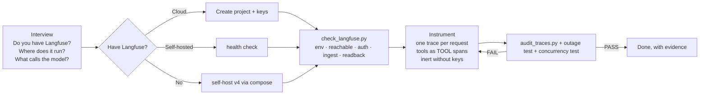

# ai-observability-skills

Agent skills that take an LLM app from "no idea what the model saw" to **verified
Langfuse tracing**: every prompt, tool call, token, and dollar, with one trace per
request, and an app that keeps working when Langfuse is down.

The skills were built from a real rollout: 16 LLM challenge containers traced into a
self-hosted Langfuse v4. Every pitfall listed here was hit in production, not taken
from docs.

## The skills

| Skill | Triggers when | What it brings |
|---|---|---|
| [`setting-up-langfuse-tracing`](skills/setting-up-langfuse-tracing/SKILL.md) | adding tracing, observability, or cost tracking to an LLM app | Interview → provision → instrument → prove. Self-host guide, a per-framework instrumentation guide, and a preflight script |
| [`verifying-langfuse-traces`](skills/verifying-langfuse-traces/SKILL.md) | tracing was just added, or traces are missing, split, unpriced, or `unknown_service` | 10-point definition of done, a symptom → cause table, and an automated trace audit |



## Tools (standard library only, no SDK needed)

```bash
# Preflight: can this machine send traces to this Langfuse with these keys?
python3 skills/setting-up-langfuse-tracing/scripts/check_langfuse.py --env-file .env
#  ✔ env        host=http://localhost:3100  public_key=pk-lf-a7a3…
#  ✔ reachable  Langfuse 4.35.0
#  ✔ auth       project=my-project
#  ✔ ingest     OTLP accepted trace ada86f7b…
#  ✔ readback   trace is stored with its nested generation
#  ALL CHECKS PASSED

# Audit real traces against the definition of done (Langfuse v4 / ClickHouse)
CLICKHOUSE_PASSWORD=… python3 skills/verifying-langfuse-traces/scripts/audit_traces.py --service my-service
#  PASS  one root per trace (0 split)
#  FAIL  user_id on every trace (4 missing)
#        → set langfuse_user_id on the root span
#  FAIL  tool calls observed (8 traces requested tools with no TOOL span)
#        → wrap tool execution in an as_type='tool' observation
#  DEFINITION OF DONE: NOT MET
```

## Install

Claude Code (personal skills):

```bash
mkdir -p ~/.claude/skills
ln -s "$PWD/skills/setting-up-langfuse-tracing" ~/.claude/skills/
ln -s "$PWD/skills/verifying-langfuse-traces"   ~/.claude/skills/
```

For a single project, copy the folders into `<project>/.claude/skills/` instead.
Other agents that read `SKILL.md` folders (e.g. through `~/.agents/skills/`) work the
same way.

Then ask: *"add Langfuse tracing to this app"*. The agent starts by asking whether you
already have Langfuse.

## Demo script (≈5 min)

1. **Before.** Open an LLM app and ask "which prompt caused that answer, and what did it
   cost?" There's no way to know.
2. **Interview.** "Add Langfuse tracing." The agent inspects the repo, then asks the
   questions it couldn't answer itself (Langfuse or not, network path, framework,
   process type, PII).
3. **Preflight.** `check_langfuse.py` shows five green checks, then deliberately fails:
   a wrong host gives a hint about container DNS, and wrong keys give a hint about the
   EU/US region.
4. **Instrument.** One tracing block, and one `config=` argument per model call.
5. **Prove.** `audit_traces.py --tree` shows one trace per request, with nested
   generations, TOOL spans, and cost. Then stop Langfuse and show the app still
   answers at the same latency.
6. **Lessons.** The pitfall tables: v4 `events_only`, `flush()` on the hot path,
   `HOSTNAME=0.0.0.0`, Compose `ports` merging, and `unknown_service`.

## Lessons encoded in these skills

- **Langfuse v4 is OTLP-only** (`events_only`). The legacy ingestion API and the traces
  read API are gone, so most tutorials are out of date.
- **Never `flush()` on the request path.** Langfuse's availability then becomes your
  app's availability. Scripts are the opposite case: they must flush before exit.
- **Tools are invisible by default** when they run as plain function calls. Wrap them.
- **Inert without keys.** CI runs untraced, and a broken tracer must never take the app
  down.
- **Traces contain everything the model saw.** The Langfuse UI is an operator-only
  system.
